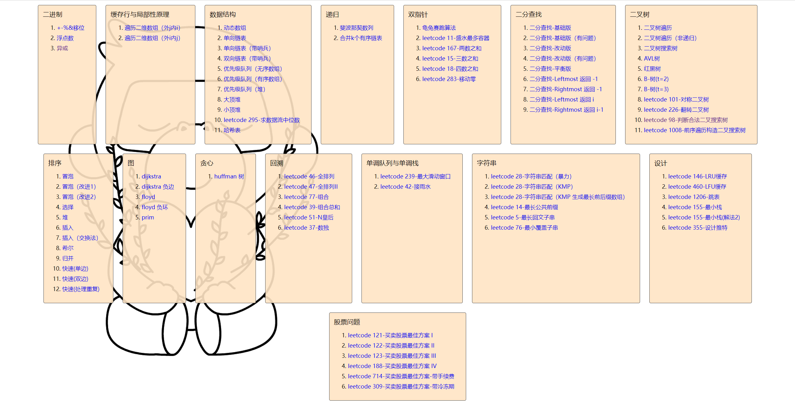
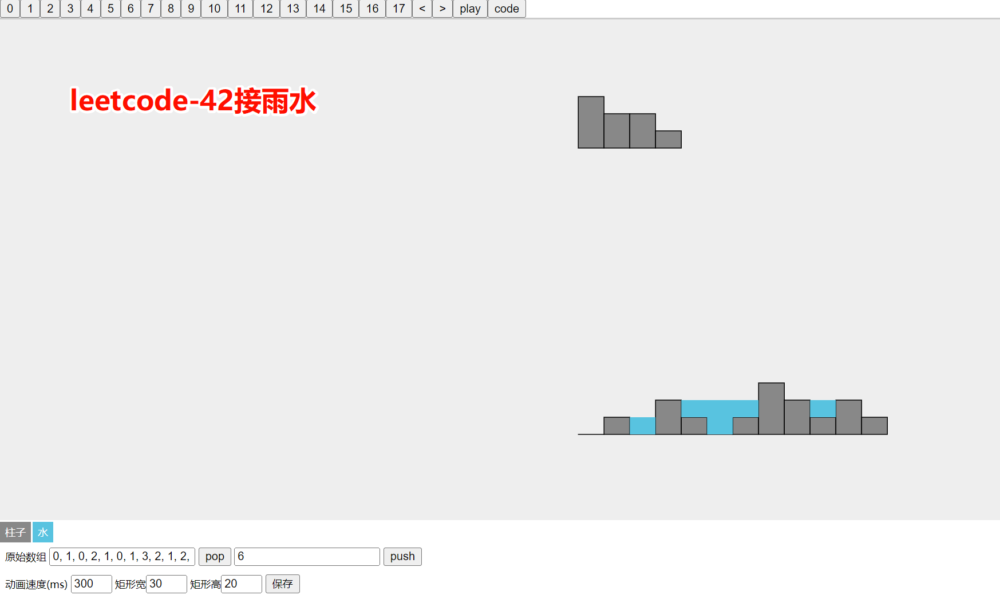
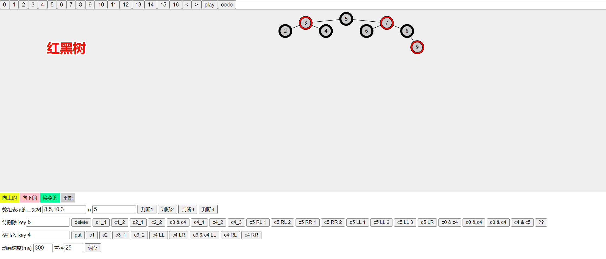
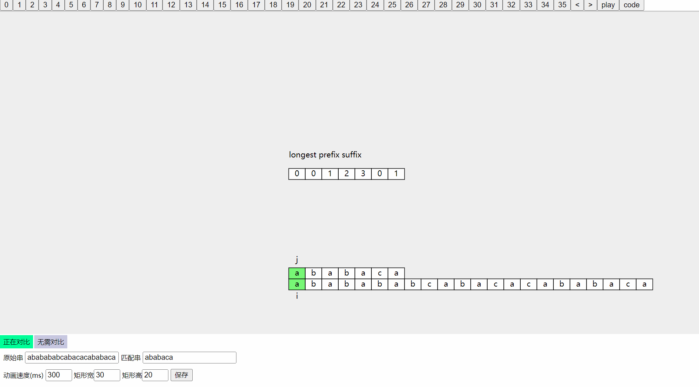
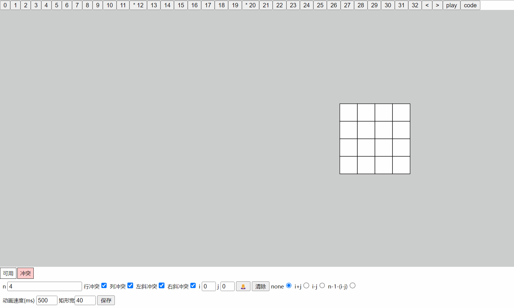

# Data-Structure-Visualization
拉取当前代码到本地，直接使用浏览器打开index.html即可索引到全部文件。

可视化视图一览：

**KMP算法**

N皇后问题

> 声明：以上代码全部来自黑马程序员满老师，感兴趣的朋友可以去系统学习黑马程序员数据结构与算法课程，链接如下：https://www.bilibili.com/video/BV1rv4y1H7o6?p=1

====
